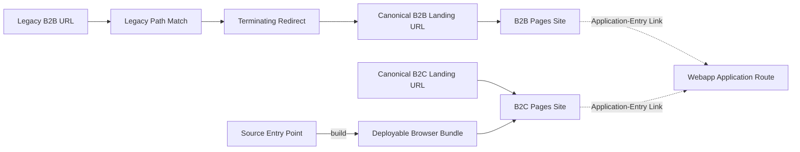

# Canonical Landing Hosts - Ubiquitous Language

**Standard:** Eric Evans, *Domain-Driven Design: Tackling Complexity in the Heart of Software*, Addison-Wesley, 2003, Chapter 2, "Communication and the Use of Language."

This vocabulary applies to Cloudflare routing configuration, the B2B and B2C Pages sites, and application-entry links to `likened-webapp`.

| Term | Definition | Must Not Mean |
| --- | --- | --- |
| Legacy B2B URL | Any `https://likened.net` URL whose path begins with `/b-to-b`. | A B2B Pages URL or a webapp application route. |
| Legacy Path Match | Cloudflare filter `(http.host eq "likened.net" and starts_with(http.request.uri.path, "/b-to-b"))`. | An exact-path-only match. |
| Canonical B2B Landing URL | `https://b2b.likened.net/`, the fixed destination of every Legacy Path Match. | A destination that preserves the legacy path suffix. |
| Path Collapse | Deliberate removal of the matching request path when redirecting to the Canonical B2B Landing URL. | An error or a route rewrite. |
| Query Discard | Deliberate omission of the incoming query string from the redirect destination. | Query-string preservation or query-driven routing. |
| Single Redirect | A Cloudflare redirect rule evaluated in `http_request_dynamic_redirect`. | A URL Rewrite Rule or Bulk Redirect. |
| Terminating Redirect | A redirect response that stops Cloudflare from evaluating later request phases. | A redirect that subsequent rewrite or origin rules can modify. |
| B2B Pages Site | The `KSimonnet/likened-b2b` GitHub Pages deployment bound to `b2b.likened.net`. | The webapp deployment or an alternate route within `likened.net`. |
| Canonical B2C Landing URL | `https://b2c.likened.net/`, the B2C marketing landing URL. | The apex host, B2B Pages Site, or Webapp Application Route. |
| B2C Pages Site | The dedicated GitHub Pages deployment bound to `b2c.likened.net`. | The B2B Pages Site or the webapp application deployment. |
| B2C Landing Asset | A B2C marketing page, style, script, font, or image required to render the Canonical B2C Landing URL. | A product application asset under `/app/`. |
| Source Entry Point | An editable JavaScript module under `public/js/` whose imports and application logic are maintained by developers. | A generated IIFE bundle or copied `dist/` artifact. |
| Deployable Browser Bundle | JavaScript generated by the repository build under `dist/js/` with package and local imports resolved for browser delivery. | The canonical editable source file. |
| Source/Artifact Boundary | The rule that source remains under `public/` and generated deployment output remains under ignored `dist/`. | Committing generated bundle internals as source. |
| Webapp Application Route | `https://likened.net/app/#/dashboard`, owned by the webapp deployment. | A path hosted by the B2B Pages Site. |
| Application-Entry Link | A B2B or B2C landing-page link that navigates a visitor to the Webapp Application Route. | A legacy marketing URL or Pages-hosted application route. |

## Relationships

## Naming Rules

- Use **Legacy B2B URL** for the incoming `likened.net/b-to-b*` request.
- Use **Canonical B2B Landing URL** for `https://b2b.likened.net/`; do not call it a legacy route.
- Use **Path Collapse** and **Query Discard** to describe the deliberate redirect behavior.
- Use **Webapp Application Route** for `https://likened.net/app/#/dashboard`; do not classify it as B2B Pages content.
- Use **Canonical B2C Landing URL** for `https://b2c.likened.net/`; do not describe it as an apex redirect destination unless an explicit routing rule changes that behavior.
- Use **B2C Pages Site** for the independently deployed B2C marketing artifact.
- Use **Source Entry Point** for `likened-b2c/public/js/landing-page.js` and **Deployable Browser Bundle** for `likened-b2c/dist/js/landing-page.js`.
- Use **Source/Artifact Boundary** when distinguishing maintainable source from generated deployment output.

## Traceability

| Artifact ID | Terms Governed |
| --- | --- |
| REQ-ROUT-001 | Legacy B2B URL, Legacy Path Match |
| REQ-ROUT-002 | Canonical B2B Landing URL, Path Collapse |
| REQ-ROUT-003 | Query Discard |
| REQ-ROUT-004 | Single Redirect, Terminating Redirect |
| CON-ROUT-001 | Canonical B2B Landing URL |
| REQ-B2C-001 | Canonical B2C Landing URL, B2C Pages Site |
| REQ-B2C-002 | B2C Landing Asset |
| REQ-B2C-003 | Application-Entry Link, Webapp Application Route |
| CON-B2C-001 | B2C Pages Site, Webapp Application Route |
| REQ-B2C-011 | Source Entry Point |
| REQ-B2C-012 | Deployable Browser Bundle |
| CON-B2C-006 | Source/Artifact Boundary |
